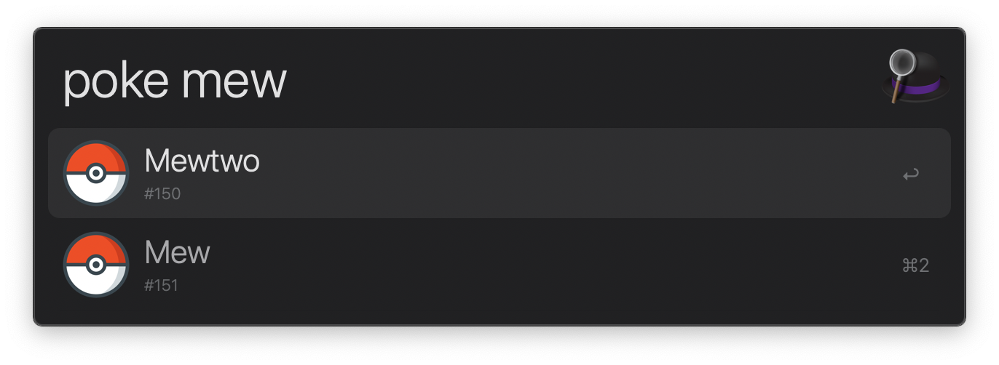

# alfred-pokemon 

> [Alfred](https://alfredapp.com) workflow to search for Pokémon

If you are looking for a better version of this workflow, use [alfred-pokedex](https://github.com/vutran/alfred-pokedex). The purpose of
this workflow is only to showcase the usage of [user configurable workflows](https://github.com/samverschueren/alfred-config).



## Install

```
$ npm install --global alfred-pokemon
```

Installing this workflow will open a text editor where you can define the language of your Pokédex. This is what happens if I set the language to German.


*Requires [Node.js](https://nodejs.org) 10+ and the Alfred [Powerpack](https://www.alfredapp.com/powerpack/).*


## Usage

In Alfred, type `poke`, <kbd>Enter</kbd>, and the name of your Pokémon.

## Related

- [alfred-pokedex](https://github.com/vutran/alfred-pokedex) - Workflow to lookup information about Pokémon.
- [alfy](https://github.com/sindresorhus/alfy) - Create Alfred workflows with ease
